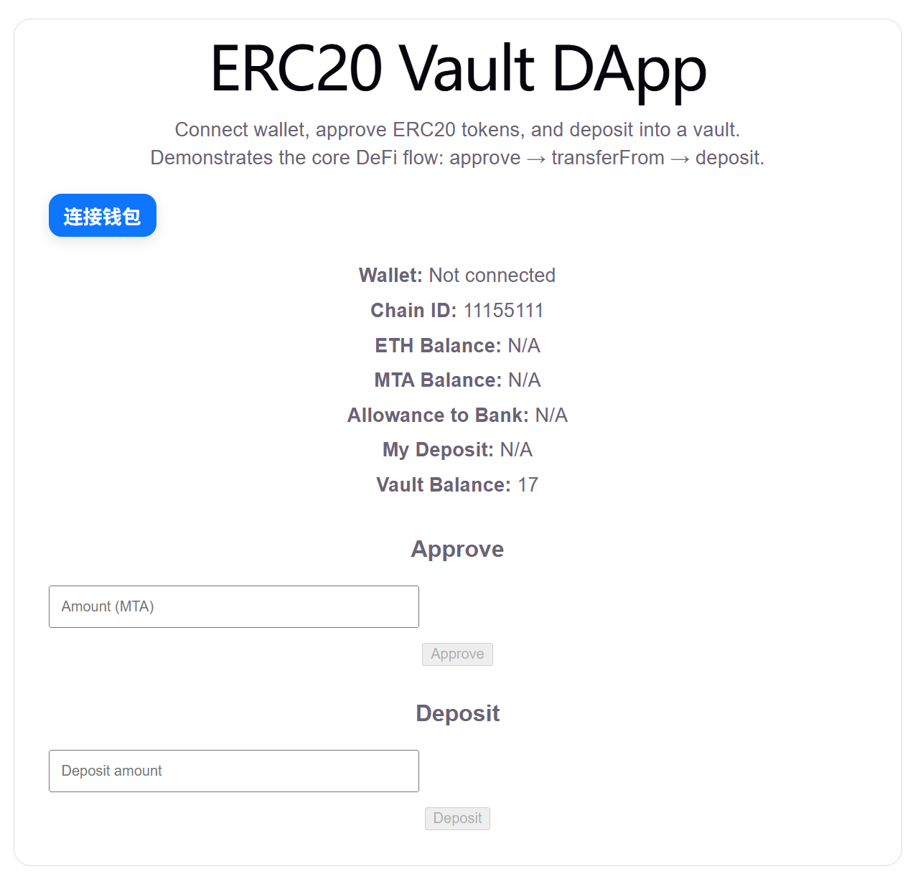
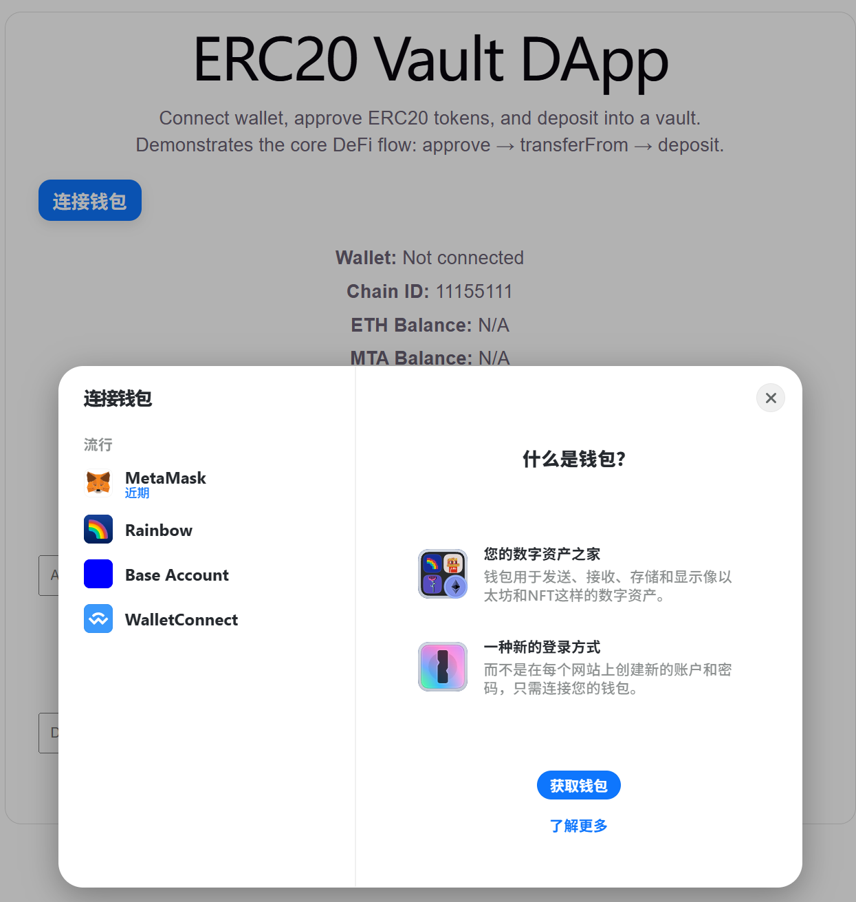
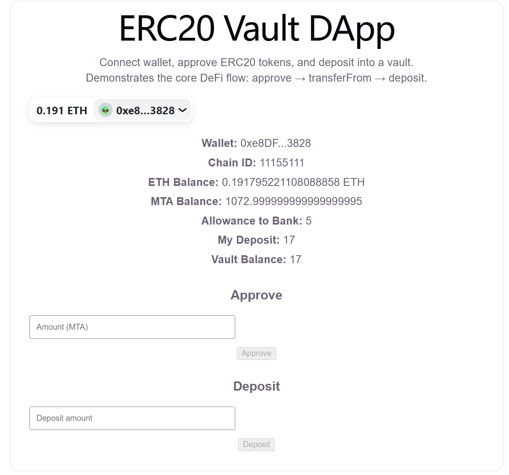
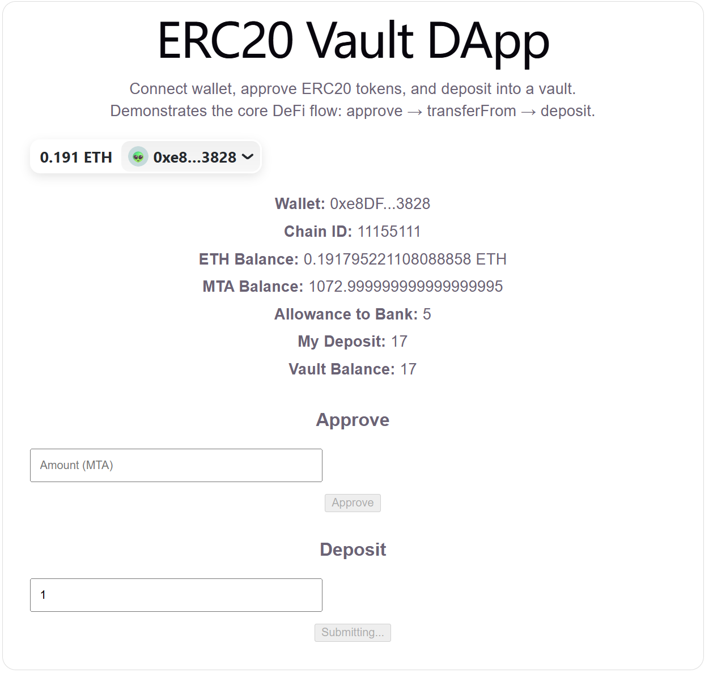
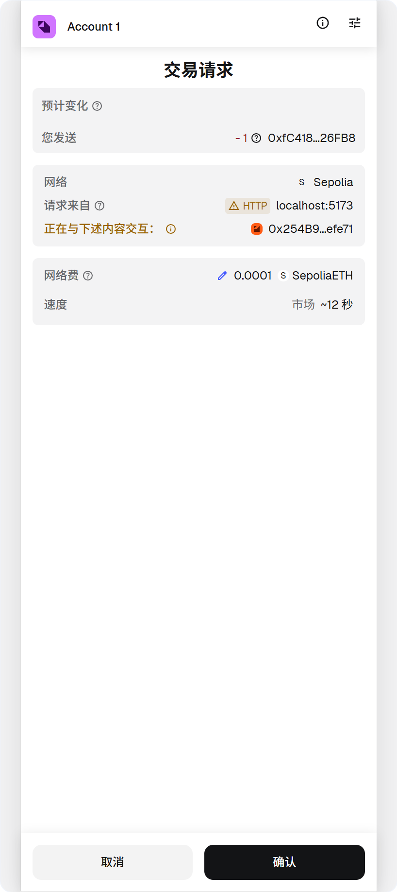
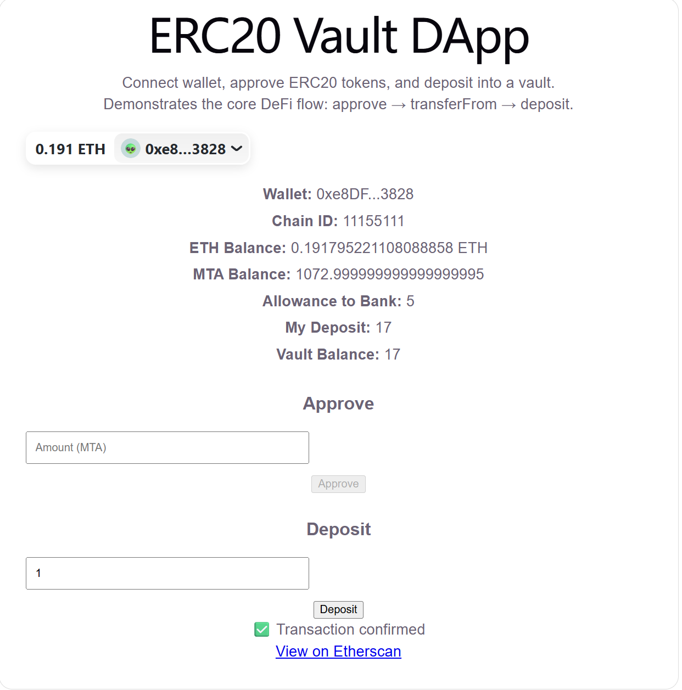
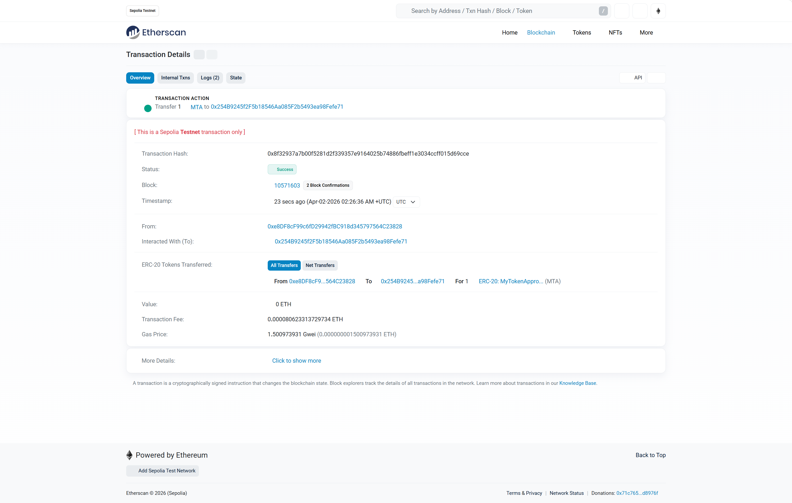

# ERC20 Vault DApp (wagmi version)

[English](#english) | [中文](#中文)

---

## English

### 🚀 Overview

A React-based Web3 dApp built with wagmi, viem, and RainbowKit, demonstrating the core DeFi flow:

**approve → transferFrom → deposit**

---

### 🚀 Features

- Wallet connection (MetaMask / WalletConnect via RainbowKit)
- ETH balance reading
- ERC20 Token balance reading
- Token approval (`approve`)
- Allowance querying (`allowance`)
- Token deposit via smart contract (`transferFrom`)
- Display user deposit and vault balance
- Transaction lifecycle handling (submit → confirm → success)
- Automatic on-chain data refresh after transactions

---

### 🧠 Core DeFi Flow

1. User connects wallet
2. Calls `approve(TokenBank, amount)`
3. Calls `deposit(amount)`
4. Smart contract executes `transferFrom`
5. Updates on-chain deposit records

---

### 🛠 Tech Stack

- React
- wagmi (React hooks for Web3)
- viem (low-level blockchain interaction)
- RainbowKit (wallet UI)
- Solidity (ERC20 + TokenBank)
- Vite

---

### 🧩 Architecture

- wagmi handles wallet connection and chain state via hooks
- viem is used internally for RPC interactions and unit conversions
- useReadContract for reading on-chain data
- useWriteContract for sending transactions
- useWaitForTransactionReceipt for transaction lifecycle tracking
- Manual refetch ensures UI stays in sync with blockchain state

---

### 🤔 Why wagmi?

Compared to ethers.js, wagmi provides a more React-friendly approach:

- Declarative hooks for blockchain state
- Built-in caching and query management
- Simplified wallet and network handling
- Better separation of concerns for frontend architecture

---

### 🔁 Comparison with ethers.js version

This project is also implemented using ethers.js:

- ethers version: focuses on low-level understanding (provider, signer)
- wagmi version: focuses on production-ready React architecture

This demonstrates both foundational knowledge and modern Web3 frontend practices.

---

### 🔄 Transaction Handling

- Submit transaction via `writeContractAsync`
- Track transaction hash (`txHash`)
- Use wagmi hooks to monitor:
  - `isConfirming`
  - `isSuccess`
- Update UI based on transaction lifecycle
- Trigger refetch after confirmation

---

### 📦 Smart Contracts (Sepolia)

- ERC20 Token: `YOUR_TOKEN_ADDRESS`
- TokenBank (Vault): `YOUR_BANK_ADDRESS`

---

### 🌍 Live Demo

https://erc20-vault-dapp-wagmi.vercel.app/

---

### 🖼 Screenshots

  
  
  
  
  
  


---

### 🧪 Run Locally

```bash
npm install
npm run dev
```

---

### ⚠️ Notes

- Network: Sepolia testnet
- Requires MetaMask or WalletConnect-compatible wallet
- Requires test ETH

---

### 💡 Key Learnings

- ERC20 approve / allowance / transferFrom model
- Differences between ethers.js and wagmi approaches
- Managing transaction lifecycle in React
- Synchronizing UI with blockchain state
- Designing UX for async Web3 interactions

---

### 🔥 Highlights

- Implemented the full DeFi interaction flow (approve → transferFrom)
- Built with modern Web3 frontend stack (wagmi + viem)
- Clean separation between read and write operations
- Real on-chain interaction (not mocked)

---

## 中文

### 🚀 项目简介

基于 React + wagmi + viem + RainbowKit 构建的 Web3 前端项目，实现 DeFi 核心流程：

**approve → transferFrom → deposit**

---

### 🚀 功能

- 钱包连接（MetaMask / WalletConnect，通过 RainbowKit）
- ETH 余额读取
- ERC20 Token 余额读取
- Token 授权（`approve`）
- 授权额度查询（`allowance`）
- 通过智能合约完成 Token 存入（`transferFrom`）
- 展示用户存款和合约总余额
- 交易生命周期管理（提交 → 确认 → 成功）
- 交易完成后自动刷新链上数据

---

### 🧠 核心流程

1. 用户连接钱包
2. 调用 `approve(TokenBank, amount)` 进行授权
3. 调用 `deposit(amount)`
4. 合约内部执行 `transferFrom` 扣款
5. 更新链上存款数据

---

### 🛠 技术栈

- React
- wagmi（Web3 React hooks）
- viem（底层链交互库）
- RainbowKit（钱包连接 UI）
- Solidity（ERC20 + TokenBank 合约）
- Vite

---

### 🧩 架构说明

- 使用 wagmi 通过 hooks 管理钱包连接与链状态
- viem 负责底层 RPC 调用与单位转换
- 使用 useReadContract 读取链上数据
- 使用 useWriteContract 发起交易
- 使用 useWaitForTransactionReceipt 管理交易生命周期
- 通过手动 refetch 保证 UI 与链上状态同步

---

### 🤔 为什么使用 wagmi？

相比 ethers.js，wagmi 更适合 React 项目：

- 提供声明式 hooks 管理链上状态
- 内置缓存与查询机制
- 简化钱包连接和网络管理
- 更清晰的前端架构分层

---

### 🔁 与 ethers.js 版本对比

本项目同时也提供 ethers.js 实现版本：

- ethers 版本：侧重底层实现（provider、signer）
- wagmi 版本：侧重工程化与 React 架构

体现了从基础能力到工程能力的完整技术路径。

---

### 🔄 交易处理

- 通过 `writeContractAsync` 提交交易
- 使用 `txHash` 跟踪交易
- 使用 wagmi hooks 监听：
  - `isConfirming`（确认中）
  - `isSuccess`（成功）
- 根据交易状态更新 UI
- 在交易完成后主动 refetch 数据

---

### 📦 合约地址（Sepolia 测试网）

- ERC20 Token：`YOUR_TOKEN_ADDRESS`
- TokenBank（Vault）：`YOUR_BANK_ADDRESS`

---

### 🌍 在线访问

https://erc20-vault-dapp-wagmi.vercel.app/

---

### 🖼 页面截图

  
  
  
  
  
  


---

### 🧪 本地运行

```bash
npm install
npm run dev
```

---

### ⚠️ 注意事项

- 使用 Sepolia 测试网
- 需要安装 MetaMask 或支持 WalletConnect 的钱包
- 需要测试 ETH

---

### 💡 学习点

- ERC20 的 approve / allowance / transferFrom 模型
- ethers.js 与 wagmi 的实现差异
- React 中的交易状态管理
- 前端与链上状态同步
- Web3 异步交互的用户体验设计

---

### 🔥 项目亮点

- 完整实现 DeFi 核心流程（approve → transferFrom）
- 使用现代 Web3 前端技术栈（wagmi + viem）
- 读写分离的清晰架构设计
- 基于真实链上数据交互（非 mock）
